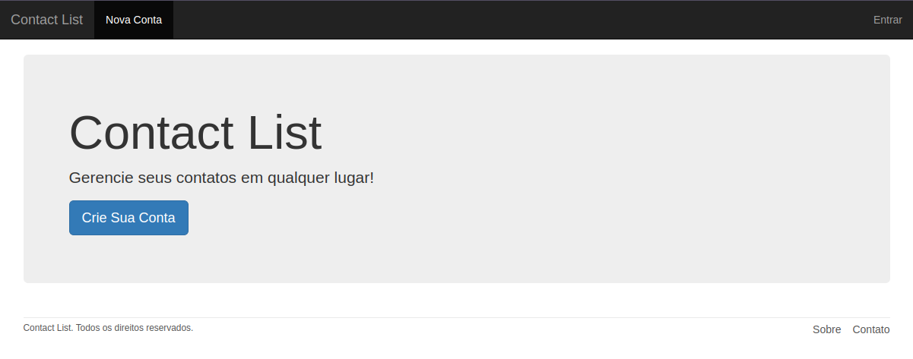
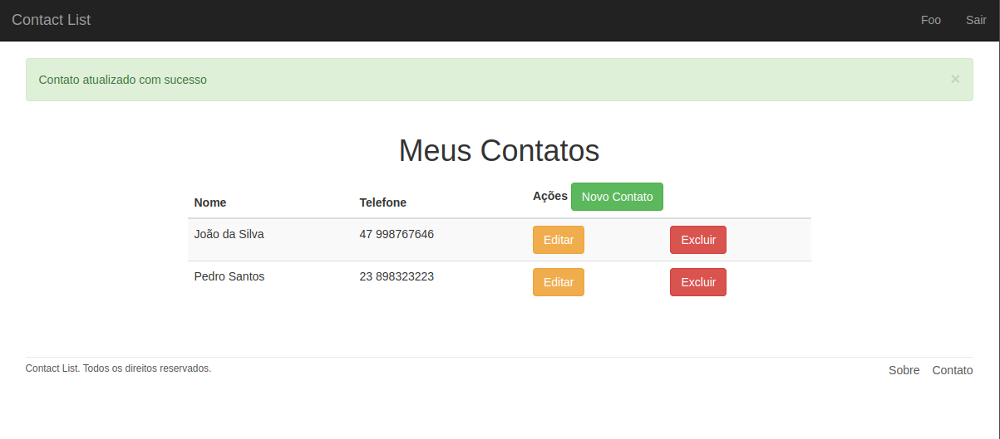
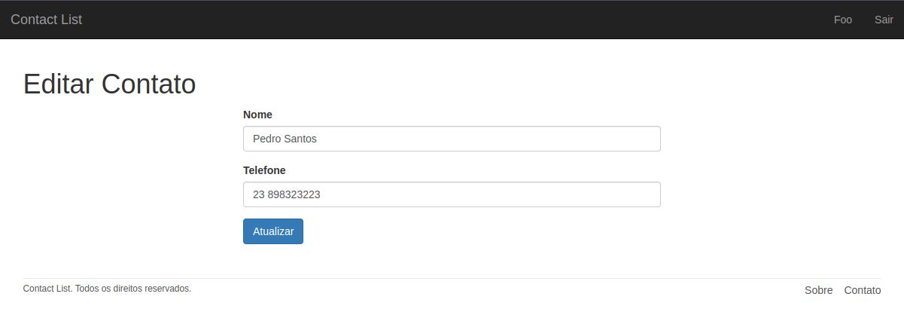

<h1 align="center" >Rails Contact 📑</h1>

<br/>
<p align="center">
  
</p>

<br/>

<p align="center">
  
   <br />
   <br />
</p>

<p align="center">
  <a href="#-projeto">Projeto</a>&nbsp;&nbsp;&nbsp;|&nbsp;&nbsp;&nbsp;
  <a href="#-tecnologias">Tecnologias</a>&nbsp;&nbsp;&nbsp;|&nbsp;&nbsp;&nbsp;
  <a href="#-material-de-apoio">Material de apoio</a>&nbsp;&nbsp;&nbsp;|&nbsp;&nbsp;&nbsp;
  <a href="#-como-baixar">Como baixar</a>&nbsp;&nbsp;&nbsp;|&nbsp;&nbsp;&nbsp;
  <a href="#-backlog">Backlog</a>&nbsp;&nbsp;&nbsp;|&nbsp;&nbsp;&nbsp;
  <a href="#-aula">Aula</a>

---

## 💬 Projeto

<p align="justify">
  Este projeto consiste em criação de usuário para autenticação e criação de uma agenda de contatos. Bem simples, para praticar e aprender Ruby on Rails

  <p align="center">
    
  </p>

  <p align="center">
    
  </p>

</p>

---

## 🛠️ Tecnologias

<p align="justify">
  Abaixo estão algumas das tecnologias utilizadas durante o desenvolvimento do projeto. Ainda foi visado: Organizar o diretório da nossa aplicação de forma concisa e limpa. Escrever código limpo visando reutilização e eficiência.
</p>

<br>
<p align="center">
  
  
  
  
  
  
  

</p>

---

## 🗂 Material de apoio

- [Bootstrap](https://getbootstrap.com/docs/4.0/getting-started/introduction/)
- [Ruby on Rails](https://guides.rubyonrails.org/)

---

## ⬇️ Como baixar

```bash
  // Clonar repositório
  $ git clone https://github.com/douglasconstancio/rails-contact.git

  // Inicie o banco de dados
  $ rails db:migrate

  // Caso queira ver as rotas
  $ rails routes

  // Rodar o projeto
  $ rails s
```
---

## 💭 Backlog

- 🟢 Melhorias visuais como espaçamento e estado de alguns botões
- ⛔️ Adicionar imagem no perfil
- ⛔️ Adicionar mais campos no cadastro do usuário
- ⛔️ Adicionar mais campos no cadastro de contato
- ⛔️ Adicionar testes em geral

---

## 🚀 Aula

  Este projeto foi baseado no curso da [Udemy](https://www.udemy.com/course/ruby-on-rails-5-na-pratica/) e foi uma grande aventura com muito código, desafios e aprendizado.

---
